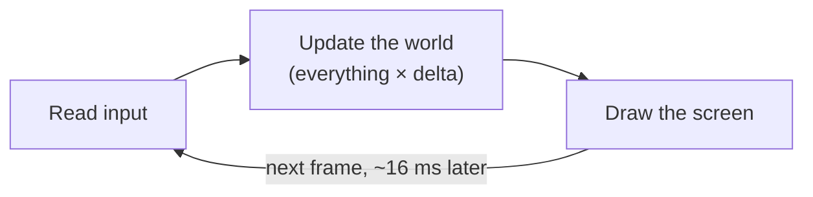
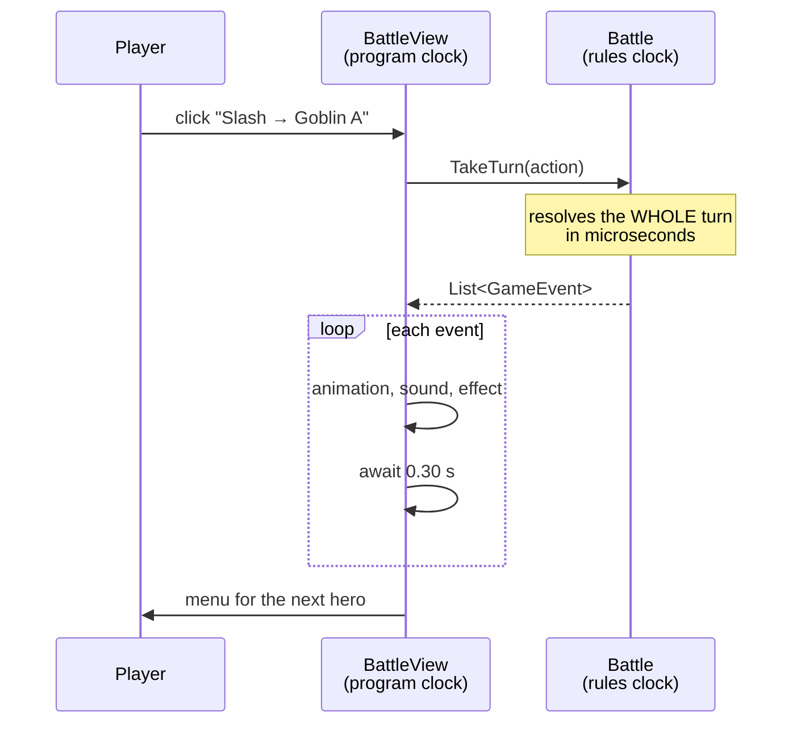

# 2. The game loop and time

> **Where you are:** chapter 2 of 20 · [index](README.md) · previous: [What makes games different](01-what-makes-games-different.md) · next: [Engines and the scene tree](03-engines-and-the-scene-tree.md)

---

## The problem

A game has to show a moving picture. A moving picture is just a lot of still
pictures shown quickly. So *something* has to draw a still picture, over and
over, forever, fast enough that a human sees motion instead of a slideshow.

That something is the **game loop**. It is the beating heart of every game ever
made, from Pong to Elden Ring, and it is about six lines long.

---

## The idea

At its absolute simplest:

```csharp
while (gameIsRunning)
{
    ReadInput();      // what is the player doing?
    Update();         // move everything, resolve everything
    Draw();           // paint the whole screen
}
```

That is it. That is a game engine's core. Everything else an engine gives you —
physics, audio, asset loading, the editor — is scaffolding around this loop.

**Read, update, draw. Forever.**



### How fast?

Fast enough to fool the eye. The conventional target is **60 frames per second**,
which gives you:

```
   1 second / 60 frames = 16.67 milliseconds per frame
```

Sixteen milliseconds to read input, update the entire world, and draw
everything. That is your whole budget. Miss it and the frame is late, which the
player sees as a stutter or "lag".

This is why game programmers care about memory allocation in a way that most
backend programmers do not. A garbage collection pause of 30ms is invisible in a
web request and is a visible hitch in a game.

> **For this project it does not matter at all.** A turn-based RPG with a dozen
> sprites uses a fraction of a percent of that budget. Do not optimise a game
> like this one for frame time; you will be optimising something that was never
> slow. [Chapter 19](19-testing-and-balancing.md) is about measuring the thing
> that *is* hard here, which is balance.

---

## Delta time, and the bug everyone writes once

Here is the single most common beginner bug in all of game development.

You want a sprite to slide to the right, so you write:

```csharp
void Update()
{
    position.X += 5;
}
```

It works on your machine. You send it to a friend. On their machine the sprite
moves at **twice the speed**, because their monitor runs at 120Hz and the loop
runs twice as often.

Your movement speed is accidentally tied to the frame rate.

### The fix

The loop measures how long the last frame took, and hands you that number. It is
called **delta** (or `dt`, or `delta time`). It is in seconds, and at 60fps it is
about `0.0167`.

```csharp
void Update(double delta)
{
    position.X += 5 * delta;      // 5 units per SECOND
}
```

Now the sprite moves five units per second on every machine, regardless of frame
rate. At 60fps it moves 0.083 per frame; at 120fps it moves 0.042 per frame,
twice as often. Same result.

**The rule:** any number that describes a *rate* — speed, spin, fade, cooldown,
regeneration — must be multiplied by delta. Any number that describes an *event*
— damage dealt, gold gained — must not.

---

## Fixed vs variable timestep

Once you know about delta, you meet the next question: should the update run at
a *fixed* rate, or as fast as it can?

| | Variable timestep | Fixed timestep |
|---|---|---|
| **What** | Update once per drawn frame, with whatever delta happened | Update at a guaranteed steady rate, e.g. exactly 60 times a second |
| **Good for** | Animation, UI, camera, anything visual | Physics, networked play, anything that must be reproducible |
| **Problem** | Results vary with frame rate — physics can explode or tunnel through walls | Can drift out of sync with drawing, needs interpolation to look smooth |

Godot gives you both, as two separate callbacks:

```csharp
public override void _Process(double delta)         { /* variable, every frame */ }
public override void _PhysicsProcess(double delta)  { /* fixed, default 60/sec  */ }
```

Real engines run a hybrid: physics on the fixed clock, everything else on the
variable one. If you have ever read that a game "runs its physics at 60Hz", this
is what that means.

**This project uses `_Process` only.** There is no physics, nothing collides,
and nothing needs to be reproducible frame-by-frame — the reproducibility this
project cares about lives in the *rules*, which do not run on a clock at all.
That is chapter 8.

---

## The two clocks in a turn-based game

Here is where turn-based games get genuinely confusing, and where a lot of
beginner code goes wrong.

Your game is turn-based. Nothing happens until the player clicks. So... does the
loop stop?

**No. The loop never stops.** What actually exists is two clocks running at once:

```
   THE PROGRAM CLOCK                    THE RULES CLOCK
   -----------------                    ---------------
   60 frames a second, always           advances one turn, when told

   idle sprites breathing               Warrior swings
   torches flickering                   Goblin takes 25
   health bars sliding                  Goblin dies
   tweens running                       ...then stops, and waits
   buttons waiting for a click
```

The mistake is to let them touch. Beginners write combat code that says "deal
damage, then wait 0.5 seconds, then show the number, then wait again" — putting
the *rules* on the *program* clock. The moment you do that:

- you cannot test the combat without a running game
- you cannot simulate a thousand fights, because each takes real seconds
- you cannot fast-forward, and you certainly cannot skip an animation
- your damage calculation now, somehow, depends on the frame rate

### How this project separates them

The rules never wait for anything. `Battle.TakeTurn()` resolves an entire turn
and returns **instantly**, handing back a list of everything that happened:

```csharp
List<GameEvent> log = battle.TakeTurn(action);
// By this line: damage applied, poison ticked, deaths recorded, turn advanced.
// Elapsed time: microseconds. Nothing has been drawn.
```

Then — and only then — the screen acts that list out slowly. In
[`BattleView.PlayEvents`](../../game/scripts/BattleView.cs):

```csharp
for (int i = 0; i < log.Count; i++)
{
    // ... play the animation, the sound, the effect for this event ...

    if (NeedsABeat(e))
        await ToSignal(GetTree().CreateTimer(BeatSeconds),
                       SceneTreeTimer.SignalName.Timeout);
}
```

**All the waiting is on the presentation side.** The rules already finished.

Here is one player turn, with both clocks on it:



The rules clock ticks exactly once, at `TakeTurn`. Everything below the dashed
arrow is the program clock spending real seconds acting out something that
already happened.

This is the concrete reason the balance harness can play 2,250 fights in a
second: it simply never calls `PlayEvents`. It throws the list away.

```csharp
// The entire game loop, in a unit test, with nobody watching:
while (!battle.IsOver)
{
    IAction action = ScoringAi.ChooseAction(battle, battle.Current!);
    battle.TakeTurn(action);        // returns instantly, log discarded
}
```

That is [`BattleRunner`](../../src/Rpg.Core.Tests/TestFixtures.cs). Compare it
to `ContinueBattle` in `BattleView.cs` — the same loop, minus the drawing and
the waiting.

---

## `async`/`await` as a sequencing tool

If you know `async`/`await` from web code, you know it as "don't block the thread
while waiting for I/O". In Godot C# it is used for something quite different and
much nicer: **writing a sequence of timed events as ordinary top-to-bottom code.**

Without it, "play the attack animation, then show the damage, then pause, then
play the death" becomes a state machine or a pile of callbacks. With it:

```csharp
private async Task ShowDamage(Damaged d, bool fatal)
{
    Audio.Play(...);                       // now
    EffectOverlay.Spawn(...);              // now
    Popup(view, $"-{d.Amount}", ...);      // now

    if (fatal) return;

    await view.PlayHit(d.IsCritical);      // ...and wait for the flinch
}
```

That reads like a script, because it is one. Under the hood `await
ToSignal(timer, ...)` yields back to the game loop, lets it draw more frames,
and resumes your method when the timer fires.

> **The trap:** `await` in Godot resumes on the main thread, but the object you
> were using might have been freed while you waited — a scene change, a battle
> ending. If you `await` and then touch a node, be sure it still exists.

---

## What it costs you

Two clocks means **the model runs ahead of the picture**, and that is a real,
permanent source of bugs. This project shipped one:

When a hero was killed by poison, the death animation played **twice**.

The cause was exactly this gap. `TakeTurn` resolves the whole turn first, so by
the time the screen replayed the poison damage, the hero was *already at zero
health in the model*. The health-bar refresh saw that and started the death
animation. A moment later the `Died` event arrived in the log and started it
again. The corpse dropped, snapped upright, and dropped again.

The fix is not to close the gap — you cannot, it is inherent to the design. The
fix is to make the presentation **idempotent** about it, so whichever code
notices the death first plays the fall, and the second just waits:

```csharp
private bool BeginDeath()
{
    if (_deathShown) return false;    // somebody already started it
    _deathShown = true;
    _sprite.Play("death", restart: true);
    // ...
    return true;
}
```

That is in [`ActorView`](../../game/scripts/ActorView.cs), and there is a test
in [`EventLogTests`](../../src/Rpg.Core.Tests/EventLogTests.cs) that documents
the underlying property:

```csharp
[Fact]
public void TheModelReadsDeadBeforeTheDeathIsAnnounced()
```

**Remember this shape.** "The simulation is ahead of the presentation" causes a
whole family of bugs, and you will meet it again in every game you write.

---

## Try it

**1. Break delta time on purpose.** In
[`SpriteAnimator._Process`](../../game/scripts/SpriteAnimator.cs), change:

```csharp
_elapsed += delta;
```

to

```csharp
_elapsed += 0.016;    // pretend every frame is exactly 60fps
```

Run it. It will look identical, because your machine probably *is* running at
60fps. That is the insidious part — this bug is invisible on the machine that
wrote it. Put it back.

**2. Change the pacing.** In [`BattleView`](../../game/scripts/BattleView.cs):

```csharp
private const double BeatSeconds = 0.30;
```

Try `0.05` and `1.0`. Watch how strongly a single number changes whether the
combat feels snappy or ponderous. Nothing about the *rules* changed at all —
identical damage, identical outcome. This is [game feel](17-ui-and-game-feel.md)
in its purest form.

---

**Next:** [Chapter 3 — Engines and the scene tree](03-engines-and-the-scene-tree.md)
