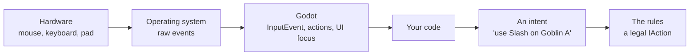
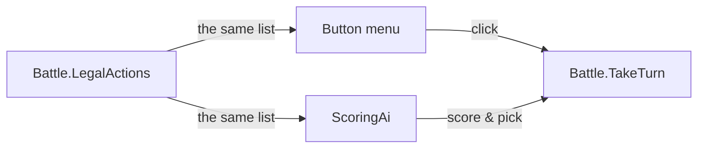
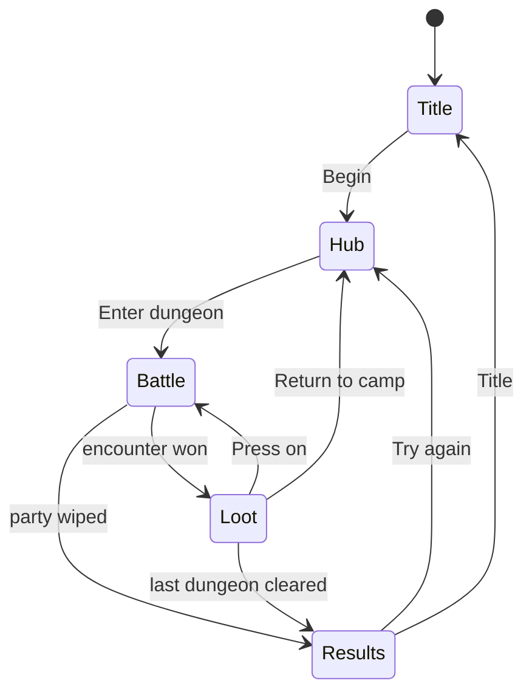
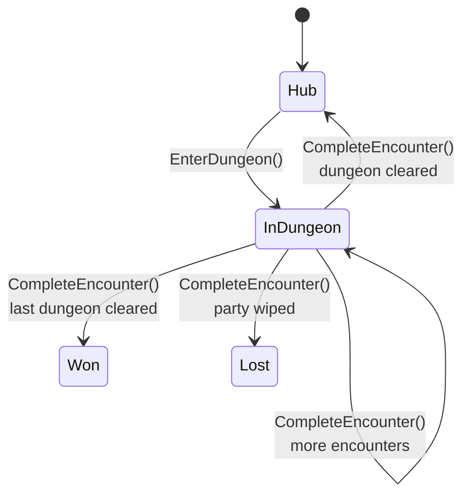

# 4. Input, signals and game flow

> **Where you are:** chapter 4 of 20 · [index](README.md) · previous: [Engines and the scene tree](03-engines-and-the-scene-tree.md) · next: [Rules vs presentation](05-rules-vs-presentation.md)

---

## The problem

A player clicks a button. A sword swings. What happened in between?

More than you would think. And the way you wire it up decides three things you
care about a lot:

- whether the player can ever do something *illegal*
- whether you can add a keyboard, a gamepad or a touchscreen later without
  rewriting the game
- whether you can find out, six months from now, *why* the game did something

This chapter is about the plumbing: how input reaches your code, how the pieces
of a Godot program talk to each other, and how a game moves between its screens.

---

## How input reaches you

Between the hardware and your code sit three layers, and it is worth knowing
which one you are standing in.



The two layers on the right are yours, and the design decision that matters
lives between them: **input produces an intent, and only the rules decide
whether that intent is legal.**

### Two ways to read input

Every engine offers both, and beginners often use the wrong one.

| | Polling | Events |
|---|---|---|
| **You ask** | "Is the key down *right now*?" | "Tell me *when* something happens" |
| **Where** | inside `_Process`, every frame | a callback the engine invokes |
| **Good for** | held inputs: movement, aiming, charging | discrete inputs: a click, a keypress, a menu choice |
| **Godot** | `Input.IsActionPressed("move_left")` | `_UnhandledInput(InputEvent e)`, or a `Button`'s `Pressed` signal |

Polling a click is a classic mistake: the frame you check might not be the frame
the mouse went down, and you either miss it or fire it twenty times. Discrete
input wants events.

A turn-based menu game is *entirely* discrete input, so this project polls
nothing. Every input is a button press, delivered as a **signal**.

### Name your inputs, never your keys

One more thing worth knowing even though this project does not use it. Godot has
an **Input Map**: you define named actions — `"confirm"`, `"cancel"`,
`"move_left"` — and bind keys, mouse buttons and gamepad inputs to them in one
place.

```csharp
// Wrong. Now the space bar is welded into the game's logic.
if (Input.IsKeyPressed(Key.Space)) Jump();

// Right. "jump" can be Space, A-button, or a touch, and the code never knows.
if (Input.IsActionJustPressed("jump")) Jump();
```

Every game that ships with remappable controls does it this way. Start doing it
on day one; retrofitting it is miserable.

---

## Signals: how Godot talks to itself

A **signal** is Godot's version of an event or observer. A node announces that
something happened; anybody interested can subscribe.

You have already seen it in every button in this project:

```csharp
var button = new Button { Text = "Wait" };
button.Pressed += () => { Audio.Play("ui_select", -10f); OnActionChosen(pass); };
```

`Pressed` is a signal. `+=` subscribes a handler. When the button is clicked,
Godot calls it. The button knows nothing about combat, and combat knows nothing
about buttons — which is exactly the decoupling you want.

There are fourteen `.Pressed +=` subscriptions in this project, and they are the
**only** place input enters the program.

### The closure trap

Here is a bug worth knowing before you write it. Look carefully at this loop
from [`GameRoot.MarchingOrder`](../../game/scripts/GameRoot.cs):

```csharp
for (int i = 0; i < _picked.Count; i++)
{
    int index = i;                    // <-- this line is not decoration

    var up = new Button { Text = "<" };
    up.Pressed += () => Swap(index, index - 1);
}
```

Why copy `i` into `index`? Because a lambda captures the *variable*, not its
value. Without the copy, every button would capture the same `i` — which after
the loop finishes equals `_picked.Count` — and every arrow would swap the wrong
pair, or throw.

> `foreach` has been safe since C# 5 (each iteration gets a fresh variable), but
> a classic `for` loop is not. If you write a handler inside a `for`, copy the
> counter first. This bug produces no error and looks correct on the screen right
> up until you click the second button.

### Awaiting a signal

Signals also power the sequencing you met in
[chapter 2](02-the-game-loop-and-time.md). `ToSignal` turns any signal into
something you can `await`:

```csharp
await ToSignal(GetTree().CreateTimer(0.3), SceneTreeTimer.SignalName.Timeout);
await ToSignal(shake, Tween.SignalName.Finished);
```

"Pause 0.3 seconds" and "wait until the shake finishes" become single lines in
ordinary top-to-bottom code. This is why the replay in `BattleView.PlayEvents`
reads like a script.

The trap, from [chapter 15](15-sprites-and-animation.md): a signal that never
fires hangs the `await` forever. Kill a tween and its `Finished` signal never
comes. Prefer awaiting a timer when the thing you are waiting on might be
cancelled.

---

## Input never reaches the rules directly

This is the most important idea in the chapter, and it is one line of design.

In most beginner games, the click handler *does the thing*:

```csharp
void OnAttackClicked() { target.Health -= damage; }      // input IS the action
```

Which means every handler has to validate: is it my turn? is the target alive?
is the skill on cooldown? am I in reach? Miss one check and the player has found
an exploit.

This project inverts it. **The buttons are built *from* the legal moves**, so the
player can only ever click something the rules already allow:

```csharp
List<IAction> legal = _campaign.Battle.LegalActions(actor);

foreach (var group in legal.OfType<SkillAction>().GroupBy(a => a.Skill.Id))
{
    var button = new Button { Text = SkillButtonText(skill) };
    button.Pressed += () => OnActionChosen(options[0]);      // an IAction, ready-made
    _menu.AddChild(button);
}
```

There is no validation in the click handler because **there is nothing to
validate**. An illegal action has no button. The player literally cannot express
it.



This is the same property that stops the AI from cheating
([chapter 9](09-turns-actions-and-resolution.md)): both the human and the
computer choose from one list, produced by the rules. Input is just the human's
way of pointing at an entry in it.

> **The general rule: turn input into an intent, and let the rules decide.** Never
> let a click handler mutate game state directly. It feels slower to write, and it
> removes an entire category of exploit and an entire category of "how did the
> player *do* that?" bug.

---

## Game flow: the state machine you already have

A game is not one screen. This one has five:



That is a **finite state machine** — a fixed set of states, and a fixed set of
allowed moves between them. It is *the* fundamental pattern of game
programming: character controllers, enemy behaviour, menus, dialogue, animation
and network sessions are all state machines, whether or not anybody wrote one
down.

### This project has two, and they are different kinds

**The screen machine is implicit.** In
[`GameRoot`](../../game/scripts/GameRoot.cs), each state is a method —
`ShowTitle`, `ShowHub`, `BeginEncounter`, `ShowLoot`, `ShowResults` — and a
transition is one calling another after `SwapScreen`. There is no `enum`, no
`switch`; the diagram above exists only in the reader's head.

**The campaign machine is explicit.** In
[`Campaign`](../../src/Rpg.Core/Progression/Campaign.cs):

```csharp
public enum CampaignPhase { Hub, InDungeon, Won, Lost }
```



And every transition is **guarded**:

```csharp
public void EnterDungeon()
{
    if (Phase != CampaignPhase.Hub)
        throw new InvalidOperationException($"Cannot enter a dungeon from {Phase}.");
    // ...
}

public void SetParty(IEnumerable<string> heroIds)
{
    if (Phase is CampaignPhase.InDungeon)
        throw new InvalidOperationException("The party cannot be changed inside a dungeon.");
    // ...
}
```

An illegal transition is not silently ignored. It **throws**, immediately, with a
message that names the state you were in. That is the "fail loudly" principle
from [chapter 6](06-state-and-entities.md), applied to time instead of data.

### Why the explicit one is better

The screen machine works. But because it lives in method calls rather than data,
nothing stops a future change from adding `ShowLoot → ShowTitle` by accident,
and nothing tells you it happened.

The campaign machine, by contrast, *cannot* drift. Add a phase to the `enum` and
the compiler shows you every `switch` that needs a case. Call a method from the
wrong phase and the game tells you on the spot.

> **When a game grows past a handful of screens, make the state machine
> explicit.** An `enum` and a `switch` is enough. The point is not elegance; it
> is that illegal transitions become impossible or loud, instead of quietly
> producing a screen with the wrong data on it.

### A real crash, and what it teaches

The two machines met badly once. At camp, the armoury showed a "give weapon"
button for each picked hero. Clicking it called:

```csharp
c.SetParty(_picked);      // needs exactly three heroes
c.EquipOn(heroId, weapon);
```

Deselect a hero, so `_picked` has two entries, click "give" — and `SetParty`
throws. The guard did its job perfectly. **The UI had offered a transition the
state machine did not allow.**

The fix was not to weaken the guard. It was to make the UI honest — the buttons
are now replaced by *"pick a full party to equip"* until there are three. Which
is the `LegalActions` principle again: **only offer what the rules will
accept.** The screen must never let the player express an intent the state
cannot fulfil.

---

## What it costs you

**Signals hide control flow.** When something happens, "who is listening?" is not
answerable by reading one file. Fourteen subscriptions is fine. Four hundred is a
codebase where nobody knows what a click does.

**`async void` handlers swallow exceptions.** `OnActionChosen` in `BattleView` is
`async void`, because a signal handler cannot return a `Task`. If anything inside
it throws, the exception is lost and the game sits there with an empty menu and
no error. Wrap the body in `try/catch` and log — this project does not, and it
should.

**Implicit state machines drift.** The screen flow is correct today because
somebody was careful. There is no test for it and no compiler check. The moment a
sixth screen appears, make it an `enum`.

**No keyboard, no gamepad.** Because everything is a `Button`, this game cannot
be played without a mouse. Fixing that is not hard — it is the first exercise
below — but it should have been an Input Map from the start.

---

## Try it

**1. Add a keyboard shortcut.** In `BattleView`, override:

```csharp
public override void _UnhandledInput(InputEvent e)
{
    if (e is InputEventKey { Pressed: true, Keycode: Key.Escape })
        Audio.Play("ui_back", -10f);
}
```

Then make Escape go back from the target menu to the skill menu. Notice you have
to *find* the current menu state to do it — that is the implicit state machine
making itself felt.

**2. Break the closure.** In `MarchingOrder`, delete `int index = i;` and use `i`
directly. Click the arrows. That is the bug, live.

**3. Make a screen illegal.** In `Campaign.EnterDungeon`, comment out the phase
guard. Then, from the results screen, find a way to call it. The game will
happily start a dungeon from a finished campaign, with no error anywhere — which
is exactly what the guard was preventing.

---

**Next:** [Chapter 5 — Rules vs presentation](05-rules-vs-presentation.md)
