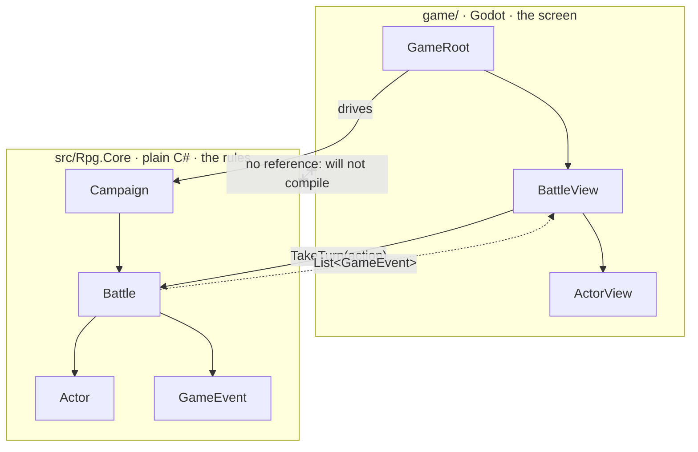

# 5. Rules vs presentation

> **Where you are:** chapter 5 of 20 · [index](README.md) · previous: [Input, signals and game flow](04-input-signals-and-game-flow.md) · next: [State and entities](06-state-and-entities.md)

**This is the most important chapter in this course.** If you take one idea away
from the whole thing, take this one.

---

## The problem

You are writing a fight. A hero clicks "Attack". You write the obvious code:

```csharp
void OnAttackButtonPressed()
{
    int damage = attacker.Attack - target.Defense / 2;
    target.Health -= damage;

    healthBar.Value = target.Health;
    damageLabel.Text = $"-{damage}";
    PlaySound("hit");
    PlayAnimation("attack");

    if (target.Health <= 0)
    {
        PlayAnimation("death");
        PlaySound("die");
        monsters.Remove(target);
        if (monsters.Count == 0) ShowVictoryScreen();
    }
}
```

This works. It is honestly a reasonable thing to write on day one. And it is
already, quietly, a dead end.

Ask it any of these questions and watch it fall over:

| Question | Why this code cannot answer it |
|---|---|
| "Is the first dungeon too hard?" | You would have to *play* it a hundred times. There is no way to simulate it. |
| "Write a test for the damage formula." | The formula is inside a button handler that needs a health bar to exist. |
| "Add an enemy AI." | The AI would have to *press buttons*. It has no other way to act. |
| "Add a replay feature." | Nothing was recorded. The information is gone. |
| "Why did I take 40 damage there?" | Nobody knows. It happened and was drawn. |
| "Make combat 2x faster." | The rules and the animation are the same code. You cannot speed one up. |

Every one of those is a normal thing to want from an RPG. This code cannot
deliver any of them, and no amount of tidying will fix it, because the problem
is not tidiness. **The rules of the game and the drawing of the game are the
same lines of code.**

---

## The idea

Draw a hard line down the middle of your game.

```
   +--------------------------------------------------+
   |  THE RULES                                        |
   |                                                   |
   |  What a hit does. Who acts next. When you die.    |
   |  Pure logic. No pictures. No sound. No waiting.   |
   |  It does not know a screen exists.                |
   +--------------------------------------------------+
                          |
                          |  one-way
                          v
   +--------------------------------------------------+
   |  THE PRESENTATION                                 |
   |                                                   |
   |  Sprites, sound, animation, buttons, pauses.      |
   |  Knows everything about the rules.                |
   |  Decides NOTHING about them.                      |
   +--------------------------------------------------+
```

Two hard requirements:

1. **The rules must not depend on the engine.** Not `using Godot;`, not a
   texture, not a node, not a timer. Nothing.
2. **The dependency arrow points one way only.** The screen calls into the
   rules. The rules never call out to the screen.

You may know this as hexagonal architecture, ports and adapters, or "keep your
domain pure". It is the same idea you would apply to a payments service. Games
just need it *more*, because a game's domain gets balanced, simulated and
replayed in ways a payments service never does.

---

## Why it matters so much more in games

In web code, separating your domain from your framework is good hygiene. In a
game it unlocks capabilities that are otherwise **flatly impossible**:

### 1. You can simulate

Once the rules do not need a screen, you can run them as fast as the CPU allows.

```bash
dotnet test --filter "FullyQualifiedName~CampaignHarness"
```

That plays **250 complete campaigns — 2,250 fights** — in about a second, and
prints:

```
   fell in Warrens     :   28  (11%)
   fell in Ember Halls :   58  (23%)
   fell in Frozen Crypt:  118  (47%)
   CLEARED ALL THREE   :   46  (18%)
```

That is not a nice-to-have. That is the *only* honest way to know whether your
game is fair. The alternative is playing it yourself two hundred times and
trusting your memory, and your memory is not trustworthy.
[Chapter 19](19-testing-and-balancing.md) is entirely about this.

### 2. You can test

```csharp
[Fact]
public void PoisonDamagesAtTheEndOfTheTurn()
```

No window. No frame. No mocking a render pipeline. The rules are ordinary C#
objects, so testing them is ordinary C# testing.

### 3. The AI plays by exactly your rules

This is subtle and important. In this project, the player's menu and the
monster AI are built from **the same function**:

```csharp
public List<IAction> LegalActions(Actor actor)
```

The UI turns that list into buttons. The AI scores that list and picks one.
Neither can do anything the other could not.

That means the AI is *structurally incapable* of cheating. It cannot see through
fog, ignore a cooldown, or hit a rank it should not reach — not because somebody
was careful, but because there is no code path that would let it. That is the
difference between a game that feels hard and a game that feels rigged.

### 4. You can change the whole look without touching the rules

This project has genuinely done this twice:

```
   v1   stick figures drawn with DrawLine()
   v2   static pixel-art PNGs
   v3   five-animation sprites from an asset pack
```

Each of those changed [`ActorView.cs`](../../game/scripts/ActorView.cs) and
nothing else. Not one line of combat code moved. That is the argument for this
architecture, demonstrated rather than asserted.

---

## In this project

### The line is enforced by the compiler

Not by a comment. Not by discipline. By the build.

**[`src/Rpg.Core/Rpg.Core.csproj`](../../src/Rpg.Core/Rpg.Core.csproj)** —
notice what is missing:

```xml
<Project Sdk="Microsoft.NET.Sdk">
  <!--
    THE MOST IMPORTANT FILE IN THE REPO.
    Notice what is NOT here: any reference to Godot.
  -->
  <PropertyGroup>
    <TargetFramework>net8.0</TargetFramework>
    <Nullable>enable</Nullable>
  </PropertyGroup>
</Project>
```

No Godot SDK. No package reference. If you type `using Godot;` in that project,
**it does not compile.** The architecture is not a guideline you might forget;
it is a wall.

**[`game/StickmanRpg.Game.csproj`](../../game/StickmanRpg.Game.csproj)** — the
arrow, in one line:

```xml
<ProjectReference Include="..\src\Rpg.Core\Rpg.Core.csproj" />
```

The game references the rules. The rules reference nothing. There is no way to
add a reference in the other direction without a circular-dependency error, so
the direction cannot rot.



Solid arrows are the only calls that exist. The dotted one is a *return value*.
There is no arrow from the rules into the screen, and there cannot be.

### What lives on each side

| Side | Project | Contains |
|---|---|---|
| **Rules** | `src/Rpg.Core` | Battle, Actor, skills, statuses, damage, AI, campaign, loot |
| **Rules tests** | `src/Rpg.Core.Tests` | 58 tests, including the balance harnesses |
| **Screen** | `game/` | Nine files: views, animation, audio, theme, effects |

### The handshake

The two sides meet at exactly one place, and it is worth memorising:

```csharp
List<GameEvent> log = battle.TakeTurn(action);
```

You give the rules **an action**. The rules give you back **a list of things that
happened**. That is the entire interface. Chapter 7 is about that list.

---

## Where the line actually goes: three hard cases

Drawing the line in principle is easy. Here are three places where it is
genuinely awkward, and what this project decided — because you will hit all
three.

### Case 1: sprite names on a rules object

[`Actor`](../../src/Rpg.Core/Entities/Actor.cs) has this:

```csharp
public string SpriteName { get; }      // "warrior" -> warrior_idle_strip.png
public string VoiceFamily { get; }     // "goblin"  -> goblin_hurt_1.ogg
```

That is presentation data, sitting on a rules object. Is it a violation?

**The decision: allow it, deliberately.** The alternative is a lookup table in
the Godot layer mapping monster ids to sprite names — which silently rots the
moment somebody adds a monster and forgets the table.

The principle that makes it acceptable: **it is a name, not a texture.**
`Rpg.Core` still has no idea what a texture is, still does not reference Godot,
and still compiles and runs with no engine present. A string is not a
dependency.

> This is the useful test for "is this a violation?" — not "does this word sound
> visual?" but **"does this force the rules to know about the engine?"**

### Case 2: content the screen also needs

The screen needs a skill's `Name` and `Description` for the button. Those live in
[`SkillDefinition`](../../src/Rpg.Core/Content/SkillDefinition.cs), on the rules
side.

**Fine.** The screen is *allowed* to know everything about the rules. The arrow
points that way. The rule being protected is only that the rules must not know
about the screen.

### Case 3: something that is genuinely both

Where should "how much damage will this do if I click here?" live?

The preview shown on a target button:

```csharp
string preview = $"{DamageCalculator.Compute(
    actor.CurrentStats, target.CurrentStats, skill.Power, false)} dmg";
```

The screen calls the *rules'* damage calculator to compute it. It does not
reimplement the formula.

**That is the whole trick.** If the screen had its own copy of the maths, the two
would drift apart, and your UI would start lying to the player — the most
corrosive bug a game can have. Presentation may *ask* the rules anything. It may
never *reimplement* them.

---

## What it costs you

**Indirection.** To follow one hit you read `BattleView` (the click), then
`SkillAction` (the resolution), then back to `BattleView` (the animation). Three
files for one swing. That is real cost, and on a small project it is felt.

**Some duplication of shape.** `GameEvent` types exist purely to carry
information across the line. In the tangled version that information was just...
there, in scope.

**It can be overdone.** A game jam entry does not need this. A puzzle game with
twelve rules does not need this. The cost is fixed and the benefit scales with
how much *simulation and tuning* your game needs. An RPG needs a lot. A
match-three needs some. A walking simulator needs almost none.

**Be honest about which you are building.** The wrong architecture applied
carefully is still the wrong architecture.

---

## Try it

**1. Try to break the wall.** Open any file in `src/Rpg.Core/` and add:

```csharp
using Godot;
```

Build it:

```bash
dotnet build
```

Read the error. That error message *is* the architecture. Delete the line.

**2. Play a game with no game.** Write this as a test in
`src/Rpg.Core.Tests/` and run it:

```csharp
[Fact]
public void ICanPlayAnEntireCampaignWithNoEngine()
{
    var result = CampaignRunner.Play(seed: 7, "warrior", "cleric", "mage");
    Assert.True(result.EncountersCleared >= 0);
}
```

Nine potential fights, loot rolls, party wipes, grading — all of it, in a
console, in milliseconds. Nothing was drawn because nothing *needed* to be.

That is what this chapter buys you.

---

**Next:** [Chapter 6 — State and entities](06-state-and-entities.md)
