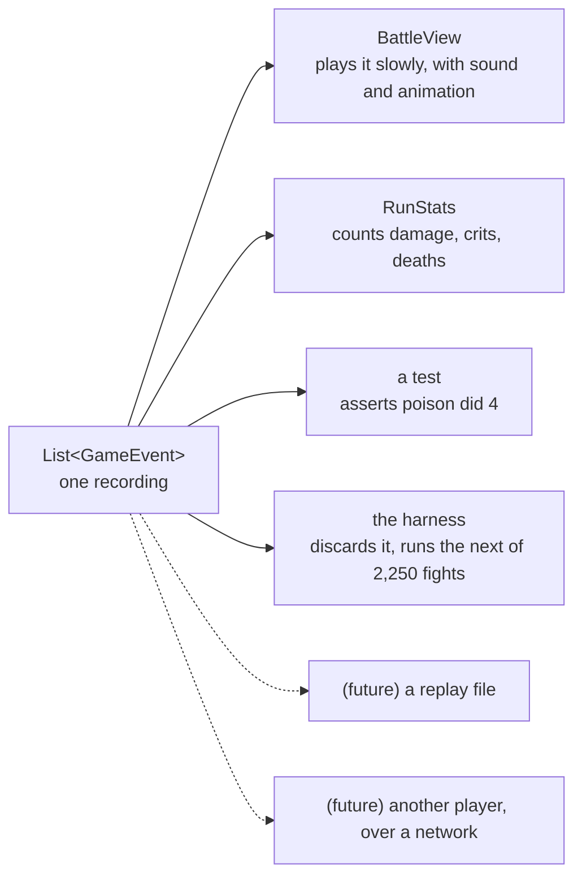
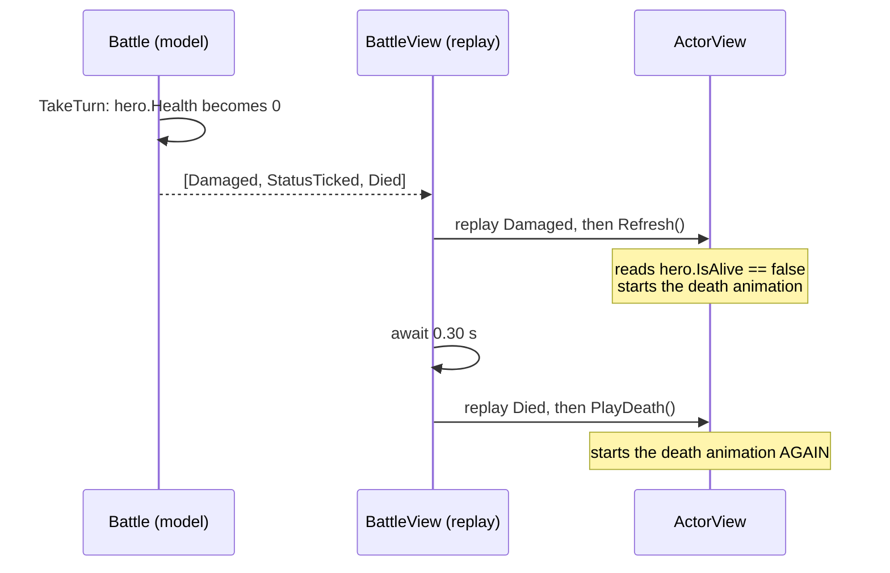

# 7. Events and replay

> **Where you are:** chapter 7 of 20 · [index](README.md) · previous: [State and entities](06-state-and-entities.md) · next: [Randomness and determinism](08-randomness-and-determinism.md)

---

## The problem

[Chapter 5](05-rules-vs-presentation.md) said the rules must not draw anything.
Fine. But the screen still has to show what happened.

So how does the information get across?

The obvious answer is a callback:

```csharp
battle.OnDamage += (target, amount) => healthBar.Flash(amount);
battle.OnDeath  += (actor)          => actor.PlayDeathAnimation();
```

This *seems* clean. It is a trap, and it is worth understanding why, because
events-as-callbacks is a pattern you will reach for instinctively.

### Why callbacks fail here

**They fire during resolution, not after it.** The rules are mid-calculation
when your handler runs. Half-updated state, in the middle of a loop.

**They cannot be paused.** The rules resolve a turn in microseconds. Your
callbacks fire in that same microsecond. But you want to show damage, wait
300ms, then show the death. Your only options are to make the *rules* wait —
destroying everything chapter 5 bought you — or to build a queue. And if you
build a queue, congratulations: you have re-invented this chapter, badly.

**They cannot be inspected, stored, or replayed.** A callback happens and is
gone. Nothing is left behind.

**They invert the dependency.** `battle.OnDamage +=` means the battle now holds
a reference to something in the screen. The arrow points backwards.

---

## The idea: don't report, record

Instead of telling anyone anything, the rules **write down what happened** and
hand you the list.

```csharp
List<GameEvent> log = battle.TakeTurn(action);
```

By the time that line finishes, the entire turn is over. Damage applied, poison
ticked, deaths recorded, turn advanced. Nothing was drawn, nobody was notified,
and no time passed.

What you are holding is a **recording**. What you do with it is entirely your
business:



Every one of those reads the *same* recording. They cannot disagree about what
happened, because there is only one account of it.

---

## The event vocabulary

From [`GameEvent.cs`](../../src/Rpg.Core/Combat/GameEvent.cs):

```csharp
public abstract record GameEvent;

public sealed record BattleStarted                                        : GameEvent;
public sealed record RoundStarted(int Round)                              : GameEvent;
public sealed record TurnStarted(string ActorId)                          : GameEvent;
public sealed record SkillUsed(string ActorId, string SkillId, string TargetId) : GameEvent;
public sealed record Damaged(string ActorId, int Amount, bool IsCritical,
                             string? SourceId = null, string? StatusId = null) : GameEvent;
public sealed record Healed(string ActorId, int Amount)                   : GameEvent;
public sealed record StatusApplied(string ActorId, string StatusId, int Turns) : GameEvent;
public sealed record StatusTicked(string ActorId, string StatusId, int RemainingTurns) : GameEvent;
public sealed record StatusExpired(string ActorId, string StatusId)       : GameEvent;
public sealed record TurnSkipped(string ActorId, string Reason)           : GameEvent;
public sealed record Repositioned(string ActorId, string SwappedWithId, int NewRank) : GameEvent;
public sealed record Died(string ActorId)                                 : GameEvent;
public sealed record BattleEnded(Team? Winner)                            : GameEvent;
```

Thirteen events. That is the complete vocabulary for describing anything that can
happen in a fight.

A real turn looks like this:

```
   TurnStarted("hero_warrior")
   SkillUsed("hero_warrior", "heavy_blow", "monster_goblin")
   Damaged("monster_goblin", 25, IsCritical: false, SourceId: "hero_warrior")
   Died("monster_goblin")
   TurnStarted("monster_brute")
```

Read it aloud and it is a sentence. That readability is not decorative — it is
what makes a combat log, a replay and a bug report all fall out for free.

### Two design decisions worth stealing

**1. Events carry ids, not object references.**

```csharp
Damaged("monster_goblin", 25, ...)      // yes
Damaged(goblinObject, 25, ...)          // no
```

A string can be written to a file or sent over a socket. An object reference
cannot. This one choice is the difference between "we could add replays and
multiplayer later" and "we could not".

**2. They are `record`s, so they compare by value.**

Which makes this test possible:

```csharp
Assert.Equal(RunBattle(seed: 42).Log, RunBattle(seed: 42).Log);
```

With ordinary classes that would compare memory addresses and always fail. With
records it compares *contents*, so it genuinely asserts "the same seed produced
the same battle". That is the determinism test, and it is
[chapter 8](08-randomness-and-determinism.md).

---

## Event sourcing, and why the stats are free

This pattern has a name — **event sourcing** — and this project is the smallest
useful demonstration of why people like it.

[`RunStats`](../../src/Rpg.Core/Progression/RunStats.cs) tracks damage dealt,
damage taken, healing, crits, biggest hit, enemies killed, heroes lost, turns
lost to stun. Fourteen numbers on the results screen.

**Combat does not know any of them exist.** There is no `stats.DamageDealt +=`
anywhere in `Battle.cs`. Instead:

```csharp
internal void Observe(IEnumerable<GameEvent> events, Func<string, Team> teamOf)
{
    foreach (GameEvent gameEvent in events)
    {
        switch (gameEvent)
        {
            case Damaged d:
                if (teamOf(d.ActorId) == Team.Heroes) DamageTaken += d.Amount;
                else
                {
                    DamageDealt += d.Amount;
                    if (d.Amount > BiggestHit) BiggestHit = d.Amount;
                }
                if (d.IsCritical) CriticalHits++;
                break;
            // ...
        }
    }
}
```

It reads the recording and counts what it sees.

Two consequences that are genuinely valuable:

- **Adding a statistic costs nothing and risks nothing.** A counter and one line
  in `Observe`. You cannot break combat by adding a stat, because you did not
  touch combat.
- **The numbers can never disagree with the screen.** Both read the same
  recording. There is no second source of truth to drift.

---

## The hard part: the model is ahead of the recording

Here is the one genuinely difficult consequence of this design. It caused a real,
shipped, visible bug in this project, and understanding it will save you the same
bug in yours.

**When you replay the log, the model has already finished.**

```
   TIME 0ms   TakeTurn() runs. Everything resolves. Hero is dead.
              log = [Damaged(hero, 9), StatusTicked, Died(hero)]

   TIME 0ms   You start replaying event 0 (Damaged).
              But hero.IsAlive is ALREADY false.
              The Died event has not been "played" yet - but the model
              does not care. It finished a microsecond ago.
```

So during replay, **the world is in the future** relative to what you are
drawing.



The bottom note is the bug. Both observers were right that the hero was dead.
Neither knew the other had already reacted.

### The bug this caused

A hero killed by poison played their death animation **twice**.

[`ActorView.Refresh`](../../game/scripts/ActorView.cs) is called after every
event to sync the health bar. The original version reasoned: "if they were alive
last time I looked and they are dead now, they must have just died — play the
death animation." Sensible. And wrong:

1. `Damaged` event replays. `Refresh` runs, sees zero health, **plays death**.
2. 300ms pass.
3. `Died` event replays. `ShowDeath` runs, **plays death again**.

The corpse dropped, snapped upright, and dropped again.

It happened on *every* death, but it was most visible on poison kills, because a
status tick puts extra events between the two triggers, so the restart landed
right in the middle of the fall.

### The fix: make the presentation idempotent

You cannot close the gap. It is inherent — it is the same property that lets you
simulate 2,250 fights in a second. So instead, make it **not matter** which
observer notices first:

```csharp
private bool BeginDeath()
{
    if (_deathShown) return false;     // somebody already started the fall
    _deathShown = true;

    _sprite.Play("death", restart: true);
    Tween fade = NewColourTween();
    fade.TweenProperty(_sprite, "modulate", new Color(1, 1, 1, 0.75f), 0.45);
    return true;
}
```

Whichever code sees it first plays the fall. The second just waits for it:

```csharp
public async Task PlayDeath()
{
    BeginDeath();                       // no-op if already falling
    await _sprite.WaitForCurrent();     // wait, do NOT restart
}
```

And the property is pinned down by a test that exists mostly to *explain itself*
to the next reader:

```csharp
[Fact]
public void TheModelReadsDeadBeforeTheDeathIsAnnounced()
{
    int damage = log.FindIndex(e => e is Damaged { StatusId: "poison", ActorId: "hero" });
    int death  = log.FindIndex(e => e is Died { ActorId: "hero" });

    Assert.True(death > damage, "the death is announced after the damage that caused it");
}
```

> **Remember this shape.** "The simulation is ahead of the presentation" is a
> whole *family* of bugs, not one bug. Anything that reacts to a *transition*
> (`was alive, now dead`) rather than to an *event* is vulnerable. Prefer
> reacting to events, and make the reaction idempotent.

---

## The second hard part: events must carry their context

Here is the other bug this project shipped, and it is subtler.

The screen wants to play the right impact sound — a hammer should thud, a dagger
should slice. So it needs to know **who swung**. The original code asked the
obvious question:

```csharp
Actor? attacker = _campaign.Battle.Current;      // whose turn is it?
```

**Always wrong.** `TakeTurn` resolves the turn *and advances the queue* before
returning the log. By the time you replay it, `Current` is the fighter who is
about to go **next**.

So every impact in the game played the wrong weapon's sound. A goblin's club
could land with a bowstring. Poison ticks borrowed a weapon from whoever happened
to be up next.

It was never noticed because it is not *wrong-looking* — it is just subtly,
constantly incoherent.

**The fix: put it in the event.** An event that requires you to go ask the world
for context is an incomplete event.

```csharp
public sealed record Damaged(
    string ActorId, int Amount, bool IsCritical,
    string? SourceId = null,      // who swung. null for poison - nobody swung.
    string? StatusId = null);     // which status burned them. null for a blow.
```

Now the screen knows, without asking:

```csharp
Actor? attacker = d.SourceId is null
    ? null
    : _campaign.Battle.State.GetActor(d.SourceId);
```

And a bonus fell out for free: poison damage now identifies itself, so a poison
tick shows the **poison splash** and hisses, instead of playing a sword impact.

There is a test that states the old approach was wrong, in so many words:

```csharp
Damaged blow = log.OfType<Damaged>().Single();

Assert.Equal("hero",    blow.SourceId);          // who actually swung
Assert.Equal("monster", battle.Current?.Id);     // who the view used to blame
```

> **The lesson:** an event should be **self-contained**. If replaying it requires
> asking the live world a question, the answer may have changed since. Put the
> answer in the event.

---

## What it costs you

**A layer of indirection.** In the tangled version, the damage number was right
there in scope. Now it travels in a record, and you write a `switch` at the far
end to take it out again.

**Events must be designed.** Too coarse (`SomethingHappened`) and the screen
cannot act on them. Too fine (`HealthChangedByOne`) and you drown. Thirteen
events for a whole combat system is about right; you will get some wrong and have
to change them, and that is normal.

**Allocation.** Every event is an object. A turn produces a handful, a fight a
few hundred. Irrelevant here. In a bullet-hell spawning 10,000 events a frame it
would not be, and you would use a pre-allocated ring buffer of structs.

**Debugging gets one step longer.** "Why did the sprite do that?" becomes "which
event caused it?" then "why was that event emitted?". In exchange, you can *print
the log* and read exactly what happened, which is usually faster than a debugger.

---

## Try it

**1. Read a fight.** Add this to any test:

```csharp
foreach (GameEvent e in BattleRunner.Run(seed: 42).Log)
    _output.WriteLine(e.ToString());
```

Records generate a readable `ToString()` for free, so you get a complete,
human-readable transcript of an entire battle. This is *the* debugging technique
for this codebase.

**2. Add an event.** Try adding `Missed(string ActorId, string TargetId)`:

- declare the record in `GameEvent.cs`
- emit it from `SkillAction.Execute`
- render it in `BattleView.Describe`

Notice how the compiler walks you through it, and how nothing in `Battle.cs`
needs to change.

**3. Prove the double-death bug.** In
[`ActorView.BeginDeath`](../../game/scripts/ActorView.cs), delete the latch:

```csharp
// if (_deathShown) return false;
// _deathShown = true;
```

Play until someone dies of poison. Watch them fall, stand up, and fall again.
Then put it back.

---

**Next:** [Chapter 8 — Randomness and determinism](08-randomness-and-determinism.md)
