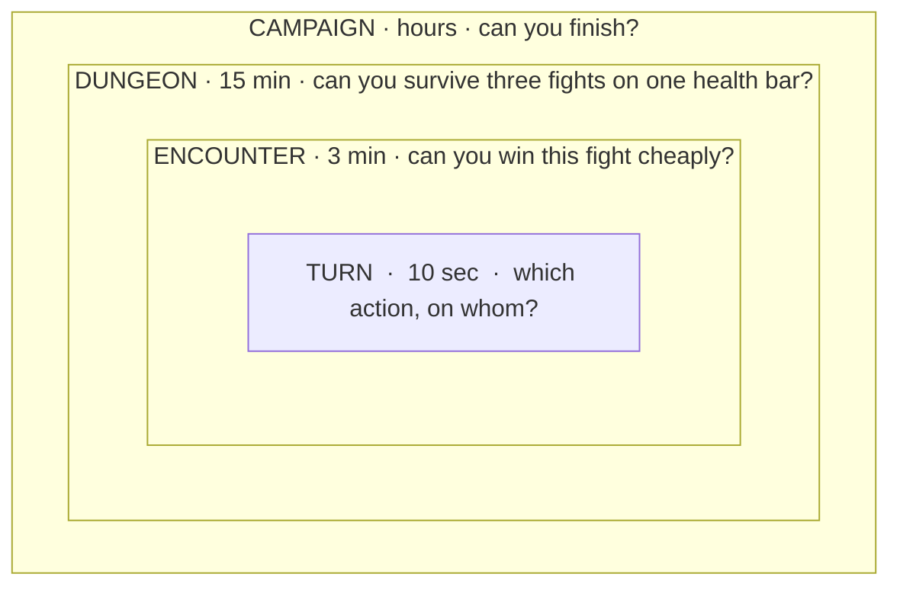
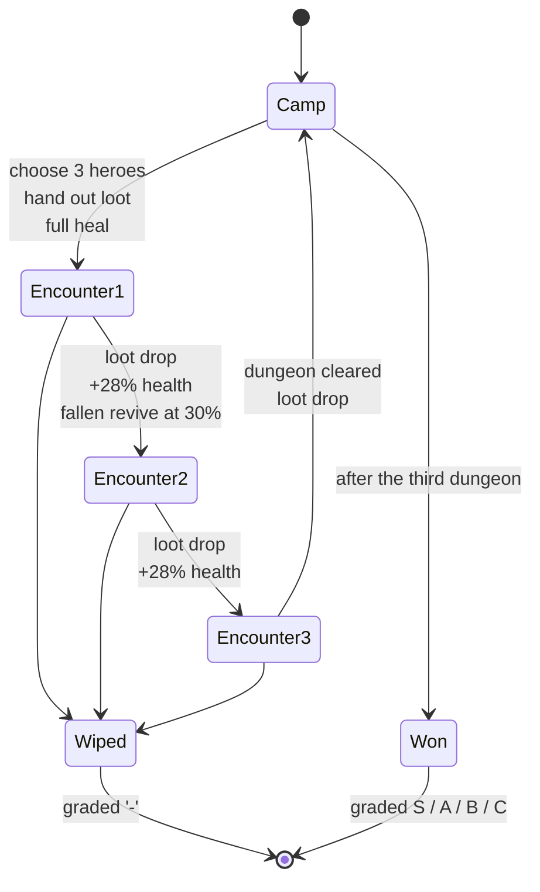

# 14. Progression and the shape of a run

> **Where you are:** chapter 14 of 20 · [index](README.md) · previous: [Enemy AI](13-enemy-ai.md) · next: [Sprites and animation](15-sprites-and-animation.md)

---

## The problem

A fight takes five minutes. A game takes hours. What connects them?

This is the question most first RPGs never answer. They build a combat system,
test it in a single arena, and then discover there is no *reason* to fight the
second battle after winning the first. Nothing carried over. Nothing was at
stake. The next fight is the same fight with different sprites.

The layer that fixes this is called **progression**, or the **meta-loop**, and
it is where most of a game's *design* — as opposed to its engineering — actually
lives.

---

## The idea: nested loops

A game is loops inside loops, and each loop needs its own tension and its own
moment of relief.



Each level asks a different question, and the answer to an inner question feeds
the outer one. A turn spent badly costs health; health lost in encounter one is
health you do not have in encounter three; a dungeon that goes badly means a
weaker party at camp.

**The mistake is to build only the innermost loop.** Combat is the most fun to
program, so it gets all the attention — and then the game has nothing to hold the
fights together.

---

## In this project

### Rule one: wounds carry

The single most important design decision in this project is one sentence from
[`Campaign`](../../src/Rpg.Core/Progression/Campaign.cs):

> Wounds carry INSIDE a dungeon, and the hub clears them.

That is what turns three fights into a game. Without it, each encounter starts
fresh and the only question is "can I win this one?" — which, since the AI
cannot out-think you, is always yes.

With it, a dungeon is **one health bar spread across three fights**. Winning the
first encounter is no longer the goal; winning it *cheaply* is. A big cooldown
spent to end a fight two rounds sooner is health you keep. That is a decision,
and it did not exist before.

### The biggest dial in the game

```csharp
/// <summary>
/// Health recovered by each surviving hero after clearing an encounter, as a
/// percentage of their maximum.
///
/// This is the single biggest difficulty dial in the game. At 0 - which is
/// where this started - the first dungeon alone ended 52% of campaigns, and
/// nobody in 250 simulated runs ever saw the third.
/// </summary>
public const int BreatherPercent = 28;
```

Read that comment carefully, because it is a whole design lesson.

The *pure* version of attrition — zero recovery between fights — sounds
uncompromising and correct. It was measured, and it was not a game: half of all
parties died in the tutorial dungeon, and the third dungeon was never reached by
anybody. Pure attrition is not tension. **It is a coin flip.**

At 28%, the party gets *bandages, not a night's sleep*. Enough that a dungeon is
survivable; not enough that the first fight stops mattering. And a fallen hero
returns at 30% when the party moves on:

```csharp
public const int RevivePercent = 30;
```

Two numbers, and they shape the entire experience more than any monster stat.
Nothing in the combat system comes close. **The meta-loop's dials are stronger
than the core loop's dials**, and beginners tune the wrong layer for months.

### Rule two: camp is a decision, not a menu

Between dungeons you return to the hub, and everyone is fully healed.

```csharp
// Resting at camp is the reward for getting out alive.
foreach (Actor hero in _party)
{
    hero.ResetForNextBattle();
    hero.ReviveWith(hero.MaxHealth);
    hero.Heal(hero.MaxHealth);
}
```

So the hub is the **reset point** — the moment of relief that makes the tension
inside a dungeon bearable. But it is also where the real strategic decision
lives: **which three heroes go in next?**

That decision only matters if the dungeons *differ*. Which is rule three.

### Rule three: each dungeon hurts you differently

The three dungeons are not "the same monsters with bigger numbers". They are
differentiated by **mechanic**:

| Dungeon | Threat | What it does to a party |
|---|---|---|
| The Warrens | Poison, 4/turn | Slow attrition. A fast party out-runs it. |
| The Ember Halls | Burning, 9/turn | Out-damages healing. Kill the casters or eat it. |
| The Frozen Crypt | Chill, Curse, Sunder | **Takes your stats.** An all-damage party stops working. |

The Crypt is the interesting one. It does not out-damage you; it *removes the
thing you were relying on*. Which means the party that flattened the Warrens is
the wrong party for the Crypt, and the hub decision becomes a real one.

> **The lesson: escalate by changing the question, not just the numbers.**
> Bigger goblins are a treadmill. A dungeon that punishes your last strategy is a
> puzzle.

This is the same idea as [chapter 11](11-statuses-and-space.md)'s "statuses as
difficulty identity", seen from the design side rather than the systems side.

### Rule four: a reward after every fight

Loot drops after **every** encounter, not just at the end of a dungeon.

```csharp
Stats.EncountersCleared++;
LootDrop drop = RollLoot();
_loot.Add(drop);
```

That cadence is deliberate. Rewards work on people through *anticipation*, and
anticipation needs frequency. A drop every three minutes keeps "what will I get?"
alive; a drop every fifteen is a chore with a prize at the end.

What *varies* is the quality, and it escalates with the dungeon:

| Rarity | Warrens | Ember Halls | Frozen Crypt |
|---|---|---|---|
| Common | 55% | 25% | 8% |
| Uncommon | 30% | 38% | 25% |
| Rare | 13% | 27% | 37% |
| Epic | 2% | 9% | 23% |
| Legendary | 0% | 1% | **7%** |

Two things this table gets right that are easy to get wrong:

- **Legendary is 0% in dungeon one.** Not "rare". Impossible. If the best item in
  the game can drop in the tutorial, the tutorial is where players farm.
- **The curve is steep at the top.** Epic goes 2% → 9% → 23%. Later dungeons do
  not feel marginally better; they feel like a different tier of reward.

And because every weapon's stats come from a rarity budget
([chapter 10](10-numbers-and-stat-design.md)), a Rare drop is *guaranteed* to be
worth more than a Common one. The player is never disappointed by a higher rarity
— a surprisingly common failure in loot games.

### Rule five: give them a reason to do it again

```csharp
public string Grade => Phase switch
{
    CampaignPhase.Lost => "-",
    CampaignPhase.Won when Stats.HeroesLost == 0 => "S",
    CampaignPhase.Won when Stats.HeroesLost <= 2 => "A",
    CampaignPhase.Won when Stats.HeroesLost <= 5 => "B",
    CampaignPhase.Won => "C",
    _ => "?",
};
```

A run has two outcomes — won or lost — which is one bit of information. A grade
turns it into a *ladder*. Finishing is no longer the end; finishing **clean** is.

Graded on heroes lost specifically, because that is the clearest measure of
having played *well* rather than merely having survived.

> **An honest note.** `HeroesLost` counts every fall, and heroes revive between
> encounters — so a three-hero party regularly "loses" six heroes in a campaign.
> The grade thresholds are tuned for that, but the results screen label is
> misleading. It is left as-is deliberately: it is a design decision about
> wording, not a bug, and you will hit the same kind of thing.

---

## Where this sits in the genre

It helps to know the words, because you will read them constantly.

| Term | Means | This project |
|---|---|---|
| **Roguelike** | Permadeath. Die and the run is over. Procedurally generated. | Partly: a wipe ends the run. |
| **Roguelite** | Permadeath, but something persists *between* runs — unlocks, currency, upgrades. | **No.** Nothing carries between campaigns. |
| **Meta-progression** | The persistent layer in a roguelite. | Absent, deliberately. |
| **Run** | One attempt, start to finish. | One campaign, ~20 minutes. |
| **Attrition** | Resources drain across a run and must be managed. | The core mechanic. |

**This project has no meta-progression**, and that is a real gap in what makes
players come back. *Hades*, *Slay the Spire* and *Dead Cells* all keep you
returning by letting a failed run *buy* something for the next one.

It was left out on purpose: meta-progression is a second economy, with its own
balance problems, and it papers over a core loop that is not fun on its own. Get
the run right first. Then add the layer that makes losing feel like progress.

---

## The shape of it, all at once



Read it as a player would: three fights on one health bar, a small breather
between each, relief at camp, a harder question next time, and a letter at the
end that says how well you did.

That is the whole game. Everything in the nineteen chapters around this one exists
to make those arrows feel good.

---

## What it costs you

**Attrition frustrates some players.** A run that dies in the third encounter
because of a mistake in the first is *exactly* the design intent — and some
people hate it. There is no mid-dungeon retreat here. A real game would consider
one, at a cost.

**No meta-progression means no long-term hook.** After a few clears there is
nothing new to unlock. That is fine for a teaching project and a genuine
limitation for a shipped one.

**The dials are strong, so they are dangerous.** `BreatherPercent` moves the
campaign clear rate more than any monster stat. That makes it easy to tune — and
easy to wreck the game with a one-line change. Guard it with the harness
([chapter 19](19-testing-and-balancing.md)).

**Grading on a quirky statistic.** See the honest note above. The results screen
says "Heroes lost: 6" to a player who only had three. Relabelling it, or counting
distinct heroes, would change the grade curve — which is why it has not been
done casually.

---

## Try it

**1. Feel the biggest dial.** Set `BreatherPercent` to `0`, then `50`, and run:

```bash
dotnet test --filter "FullyQualifiedName~CampaignHarness"
```

Nothing else in the game moves the numbers this far. Now you know where the
difficulty actually lives.

**2. Add a fourth dungeon.** It is pure data in
[`DungeonDefinition.cs`](../../src/Rpg.Core/Progression/DungeonDefinition.cs) —
a name, a threat, three encounters, a loot table. The campaign machine, the hub,
the results screen and the harness all pick it up without a line of code
changing. Then watch the clear rate fall.

**3. Change the cadence.** Make loot drop only when a dungeon is cleared, instead
of after every encounter. Play it. Notice how much *longer* the dungeon feels
with the same number of fights.

---

**Next:** [Chapter 15 — Sprites and animation](15-sprites-and-animation.md)
