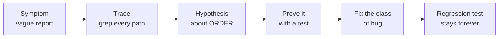

# 18. Debugging a game

> **Where you are:** chapter 18 of 20 · [index](README.md) · previous: [UI and game feel](17-ui-and-game-feel.md) · next: [Testing and balancing](19-testing-and-balancing.md)

---

## The problem

You know how to debug a web request: set a breakpoint, reproduce the request,
step through. The whole thing is a straight line from input to output, and it
holds still while you look at it.

A game does not hold still.

- It runs sixty times a second, so a breakpoint freezes a *frame*, and the bug
  was caused by what happened three frames earlier.
- Its state is enormous and mutable, and the interesting part changed while you
  were reading the uninteresting part.
- It has randomness, so "do it again" produces a different game.
- Half of what goes wrong is *timing* — an animation that starts twice, a sound
  that plays late — and timing does not survive being paused.
- And the worst bugs are the ones the player reports as *"it happened once, on
  the second dungeon, I think a goblin was involved"*.

So games get debugged differently, and the good news is that most of the tools
are things you build into the game once and use forever.

---

## The toolkit

### 1. Make every bug reproducible with a seed

If all randomness flows from one number
([chapter 8](08-randomness-and-determinism.md)), then that number *is* the bug
report.

This project prints the seed on the title screen and the results screen. A
player says *"seed 8815, second dungeon, the Cleric died and I don't know why"*
and you can watch exactly what they watched:

```csharp
var campaign = new Campaign(content, seed: 8815);
```

**This is the single highest-value debugging investment a game can make**, and it
costs nothing if you did chapter 8 properly. Without it, every bug report is a
story. With it, every bug report is a test case.

### 2. Read the recording, not the screen

The screen shows you what the game *drew*. The event log shows you what the game
*did*. When they disagree, the log is the truth.

```csharp
foreach (GameEvent e in BattleRunner.Run(seed: 42).Log)
    _output.WriteLine(e.ToString());
```

Because events are records, `ToString()` is generated for you, and the output is
a complete, readable transcript:

```
TurnStarted { ActorId = hero_cleric }
SkillUsed { ActorId = hero_cleric, SkillId = healing_word, TargetId = hero_warrior }
Healed { ActorId = hero_warrior, Amount = 26 }
Damaged { ActorId = hero_cleric, Amount = 4, IsCritical = False, SourceId = , StatusId = poison }
StatusExpired { ActorId = hero_cleric, StatusId = poison }
TurnStarted { ActorId = m0_goblin_grunt }
```

That is a fight you can read on a train. Most "why did that happen?" questions
in this project are answered by printing the log and looking — faster than any
debugger, because nothing has to be paused.

> **This is the payoff of [chapter 7](07-events-and-replay.md) that nobody
> mentions.** An event log is not just for replays and stats. It is a debugger
> that is always on.

### 3. Write a diagnostic test instead of setting a breakpoint

When the Warrens killed 0% of parties and three tuning attempts did nothing, the
right move was not a breakpoint. It was a throwaway test that *measured*:

```csharp
[Fact]
public void TempDiag_WhatIsActuallyHappeningInTheWarrens()
{
    // ...run 250 campaigns, and print:
    //   lowest party health seen, avg : 73%
    //   party health leaving Warrens  : 89%
    //   avg rounds per encounter      : 3.4
}
```

Three and a half rounds per fight. The monsters were dying before they got to
swing. No breakpoint would have shown that, because it is a property of two
hundred fights, not of one frame.

> **When a bug is statistical — "too easy", "the AI feels dumb", "poison seems
> weak" — measure it with a test.** Then delete the test. (This one was called
> `_TempDiag.cs`, and the underscore is a reminder that it must not be committed.)

### 4. Fail loudly at the boundary

The cheapest bug to fix is the one that crashes on the line that caused it. The
most expensive is the one that corrupts something quietly and surfaces three
files away on Thursday.

So this project explodes early, on purpose:

```csharp
// BattleState: two actors with one id would corrupt every event downstream.
if (duplicate is not null)
    throw new ArgumentException($"Two actors share the id '{duplicate.Key}'. ...");

// Battle.TakeTurn: acting out of turn would desynchronise everything.
if (!ReferenceEquals(action.Actor, Current))
    throw new InvalidOperationException($"It is {Current?.Name}'s turn, but ...");

// Campaign: an illegal phase transition is a bug in the caller.
if (Phase != CampaignPhase.Hub)
    throw new InvalidOperationException($"Cannot enter a dungeon from {Phase}.");
```

Each of those turns a whole *category* of mysterious late bug into one immediate,
named crash. Write them at every boundary where bad input could get in, and make
the message say what was wrong — `'{duplicate.Key}'`, not `"invalid state"`.

### 5. Look at the live tree

Run the game from the Godot editor (**F5**) and open the **Remote** tab in the
Scene panel. That is the node tree of the *running* game, rebuilding itself live
as screens swap. Click any node and its properties appear in the inspector.

When a sprite is invisible, a button is unclickable, or a layout is wrong, this
answers "what is actually on screen?" in seconds. It is Godot's best debugging
tool and beginners rarely find it.

### 6. Automate looking at the screen

Some bugs are only visible. For those:

```bash
godot --path game -- --shots
```

plays a real encounter, simulates a whole campaign, and saves five screenshots.
Not verification — a human still looks — but it turns "check the game still
renders" from a five-minute chore into one command, which means it actually gets
done.

And the cheapest smoke test of all:

```bash
godot --headless --path game --quit-after 300
```

Boots the game with no window and quits. If a script fails to compile or a scene
fails to load, this catches it in five seconds.

### 7. Decide deliberately what fails silently

```csharp
/// Silently does nothing if the file is missing - a game that crashes
/// because an optional sound effect is absent is a badly built game.
public static void Play(string soundName, ...)
```

That is the right call for audio, and it caused a real problem: the folder the
game loads sound from, `game/audio/`, was missed from the first commit. **The
game ran perfectly and said nothing.** Nobody noticed, because the failure mode
was designed to be unnoticeable.

The lesson is not "never fail silently". Decoration *should* fail silently. The
lesson is:

> **Every silent failure should be loud exactly once.** `GD.PushWarning` on the
> first missing file, then silence. You get the robustness *and* the diagnosis.

Two rules that pair well:

- Crash loudly when the **rules** are wrong.
- Fail quietly when the **decoration** is missing — but log it once.

---

## Two case studies

Debugging is a method, not a toolkit, and the method is easiest to see on real
bugs. Both of these shipped in this project.

### Case 1: the death that played twice

**The symptom.** *"The last death of a hero happens twice if he has a status."* A
player report, imprecise, but with two useful details: *death*, and *status*.

**Trace the path.** `grep` for everything that could start a death animation:

```
ActorView.cs:159   if (_wasAlive && !alive) _sprite.Play("death", restart: true);
ActorView.cs:253   _sprite.Play("death", restart: true);      // in PlayDeath
ActorView.cs:259   await _sprite.PlayOnce("death");           // ALSO restarts
BattleView.cs:526  case Died dead: await ShowDeath(dead);
```

Three places restart the same animation. That is already suspicious.

**Form a hypothesis about ordering.** Why would a *status* make it worse? Because
a poison kill puts extra events between the `Damaged` that drops health to zero
and the `Died` that announces it — so the two triggers land further apart, and
the restart is visible mid-fall.

**Prove it with a test before fixing it.** Not a test that the bug exists — a
test that pins the *property* the fix depends on:

```csharp
[Fact]
public void TheModelReadsDeadBeforeTheDeathIsAnnounced()
{
    int damage = log.FindIndex(e => e is Damaged { StatusId: "poison", ActorId: "hero" });
    int death  = log.FindIndex(e => e is Died { ActorId: "hero" });
    Assert.True(death > damage);
}
```

The model is ahead of the replay. That is not a bug — it is the design
([chapter 7](07-events-and-replay.md)) — so the fix has to live with it.

**Fix the class, not the instance.** A latch, so that whichever code notices the
death first plays it and everyone else waits:

```csharp
private bool BeginDeath()
{
    if (_deathShown) return false;
    _deathShown = true;
    // ...
}
```

**Leave a test behind.** `NobodyIsEverAnnouncedDeadTwiceInAWholeBattle` now runs
200 seeds on every build.



### Case 2: the bug nobody noticed

Every impact sound in the game was keyed to **the wrong fighter's weapon**. A
goblin's club could land with a bowstring. Poison ticks borrowed a weapon from
whoever happened to be up next.

This shipped for the entire life of the project. **Nobody reported it**, because
it is not *wrong-looking*. It is merely, constantly, subtly incoherent — and
players experience that as "the audio is a bit cheap", not as a bug.

It was found by **reading the code**, during a review:

```csharp
Actor? attacker = _campaign.Battle.Current;      // "whose turn is it?"
```

...and knowing, from [chapter 7](07-events-and-replay.md), that by replay time
the turn has already advanced. `Current` is always the *next* fighter.

> **The lesson: some bugs have no symptom a player can name.** They are found
> only by review — by reading code with the design principles in your head and
> asking "is this actually true?". Budget time for that. It found the most
> pervasive bug in the project.

The fix was to put the attacker *in the event*, which is also the general rule
for [chapter 7](07-events-and-replay.md): an event that requires asking the live
world a question is incomplete.

---

## Saving and loading

Not implemented in this project — it is on the [roadmap](../roadmap.md) — but it
belongs here, because save/load is the ultimate debugging tool (*"send me your
save file"*) and because the architecture was designed to make it possible.

### What has to be captured

Everything that would be different tomorrow:

| Layer | State |
|---|---|
| Each `Actor` | health, active statuses and their remaining turns, cooldowns, weapon |
| `BattleState` | the actor list **in order** — the order *is* the formation |
| `TurnQueue` | round number, this round's order, whose turn it is |
| `Battle` | which deaths have been announced |
| `Campaign` | phase, dungeon index, encounter index, loot found, party |
| The RNG | **its internal state** — not the seed, the position in the stream |

That last row is the one people forget. Saving the seed and restarting gives you
the *beginning* of the stream; you need to be where the stream *was*:

```csharp
/// The current internal state. Save this alongside a game save and you can
/// resume a battle mid-fight with the randomness continuing exactly where it
/// left off.
public ulong State => _state;
```

### Two strategies

**Snapshot.** Serialise every row in the table above to JSON. Straightforward,
robust, and the file is large and tied to your class layout — rename a field and
old saves break.

**Replay.** Save the *seed* and the *list of actions the player took*. To load,
replay them through the rules at full speed — which, because the rules need no
screen, takes milliseconds. The save is tiny and it doubles as a replay file.

Replay is elegant and fragile: change any rule and every old save now plays out
differently, or crashes. Shipped games usually snapshot, and use replay for
debugging and spectating.

**Both strategies are only possible because of two earlier decisions:** events
carry ids rather than object references ([chapter 7](07-events-and-replay.md)),
and randomness is seeded and deterministic
([chapter 8](08-randomness-and-determinism.md)). Neither was made *for*
save/load. Both were made because they are the difference between "we could add
that later" and "we could not".

---

## What it costs you

**Seeds only help if everything is seeded.** One `Random.Shared` anywhere in the
rules and reproducibility is gone, silently. Audio pitch jitter uses Godot's own
RNG — which is fine, because it is *presentation* and changes nothing about the
rules — but the line has to be held consciously.

**Diagnostic tests get committed.** `_TempDiag.cs` was deleted. The underscore
helped. A `git status` before committing helped more.

**Fail-loudly guards cost a little trust.** A player who hits one sees a crash
where a softer game would have limped on. That is the correct trade for a rules
engine, and it is still a trade.

**Logging is not free, and it is not neutral.** A `GD.Print` inside `_Process`
runs sixty times a second and will drown you. Log at the *seams* — where a turn
resolves, where a screen changes — not in the loop.

---

## Try it

**1. Replay a bug.** Play until something looks odd, note the seed from the
results screen, and reproduce it in a test:

```csharp
var result = CampaignRunner.Play(seed: YOUR_SEED, "warrior", "cleric", "mage");
```

Then print the log for the encounter in question and read what actually
happened.

**2. Make a silent failure loud, once.** In `Audio.Load`, when a file is missing
for the first time, add `GD.PushWarning($"missing sound: {soundName}")`. Delete
one `.ogg` and run the game. You now have the robustness *and* the diagnosis.

**3. Write a diagnostic.** Add a temporary test that prints the average number of
rounds per encounter across 100 campaigns. That single number told this project
more about its balance than a week of playing it did. Then delete the test.

---

**Next:** [Chapter 19 — Testing and balancing](19-testing-and-balancing.md)
